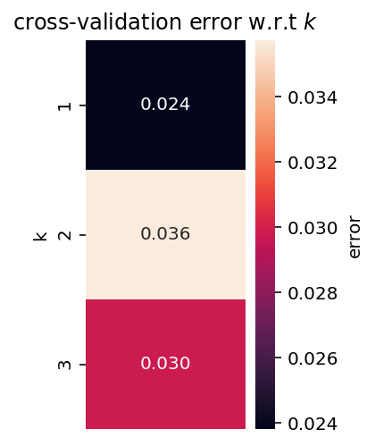

# Comparison of Supervised Machine Learning Algorithms

*Course*: COGS 118A - Supervised Machine Learning Algorithms (Winter 2020)

## Data Sets

The following data sets were taken from the UCI Machine Learning Repository (http://archive.ics.uci.edu/ml):

* **Bank Note Authentication**

    * Jupyter Notebook: [bank-note-auth.ipynb](./bank-note-auth.ipynb)
    * Data: [bank-note-authentication.csv](./bank-note-authentication.csv)
    

* **Wheat Seeds** 

    * Jupyter Notebook: [wheat-seeds.ipynb](./wheat-seeds.ipynb)
    * Data: [seeds.csv](./seeds.csv)
    

* **Skin Segmentation** 

    * Jupyter Notebook: [skin-segmentation.ipynb](./skin-segmentation.ipynb)
    * Data: [Skin_NonSkin.csv](./Skin_NonSkin.csv)

## Final Project Report

> Write a report with >1,000 words (excluding references) including main sections: a) Abstract, b) Introduction, c) Methods, d) Experiments, e) Conclusions, and f) References. The basic requirement for the final project is based on the two-class classification problem. 

> Train your classifiers using the setting (not all metrics are needed) described in the empirical study by Caruana and Niculescu-Mizil. You are supposed to reproduce consistent results as in the paper. However, do expect some small variations. When evaluating the algorithms, you don’t need to use all the metrics that were reported in the paper. Using one metric, e.g. the classification accuracy, is sufficient. Please report the cross-validated classification results with the corresponding learned hyper-parameters.

> If you compute accuracy and follow the basic requirement picking 3 classifiers and 3 datasets. You are looking at 3 trials/repeats X 3 classifiers X 3 datasets X 3 partitions (20/80, 50/50, 80/20). Each time you always report the best accuracy under the chosen hyper-parameter. Since for the accuracy is averaged among three 3 trials/repeats to rank order the classifiers, you will report 3 classifiers X 3 datasets X 3 partitions  (20/80, 50/50, 80/20)  X 3. accuracies (train, validation, test). When trying to debug, always try to see the training accuracy to see if you are able to at least push the training accuracy high (to overfit the data) as a sanity check making sure your implementation is correct. The heatmaps for your hyper-parameters are the details that do not need to be too carefully compared with. The searching for the hyper-parameters is internal and the final conclusion about the classifiers is based on the best hyper-parameter you have obtained for each time.

## Pseudo code
    For i in three different datasets
        For j in three types of different partitions
             For t in three different trials/repeats (shuffling or performing random splits for each type j (20/80,80/20) )
                  For c in three different classifiers
                         cross validate
                          find the optimal hyper-parameter
                          train using the hyper-parameter above
                          obtain the training and validation accuracy/error
                           test
                           obtain the testing accuracy
              compute the averaged accuracy (training, validation, and testing) for each classifier c out of three trials/repeats
              rank order the classifiers

## Chosen Classifiers

* Linear SVM with `scikit-learn`

    

* KNN with `scikit-learn`

    

* Decision Tree with `scikit-learn`

     
    
## Methodology

This section summarizes the parameters used for each learning algorithm.

* **SVM**: I used the following kernel with SciKit Learn: linear. The regularization parameters used were: 0.1, 1, 10, 100, 1000.

* **K-NN**: Uses KNeighborsClassifier from sklearn to create a grid searcher with 5-fold cross-validation with up to 3 neighbors. The KNN uses the Euclidean distance as weights.

* **Decision Tree**: Uses DecisionTreeClassifier from sklearn and GridSearchCV with 10-fold cross-validation with a max-depth of 5. 

## Useful Resources

* Course Website (https://sites.google.com/site/ucsdcogs118awinter2020/)

* An Empirical Comparison of Supervised Learning Algorithms (https://www.cs.cornell.edu/~caruana/ctp/ct.papers/caruana.icml06.pdf)

* Journal of Machine Learning Research (http://www.jmlr.org/)

* Pattern Analysis and Machine Intelligence (https://www.computer.org/csdl/journal/tp)

* ICML (https://icml.cc/)

## Acknowledgements

* Lohweg, V. and Doerksen, H. (2012). 'Bank Note Authentication Data Set', UCI Machine Learning Repository, (https://archive.ics.uci.edu/ml/datasets/banknote+authentication/)

* M. Charytanowicz, J. Niewczas, P. Kulczyckim, P. Kowalski, S. Lukasik, S. Zak, 'Seeds Data Set', UCI Machine Learning Repository, (https://archive.ics.uci.edu/ml/datasets/seeds) 

* Rajen Bhatt, Abhinav Dhall, 'Skin Segmentation Dataset', UCI Machine Learning Repository, (https://archive.ics.uci.edu/ml/datasets/Skin+Segmentation)
